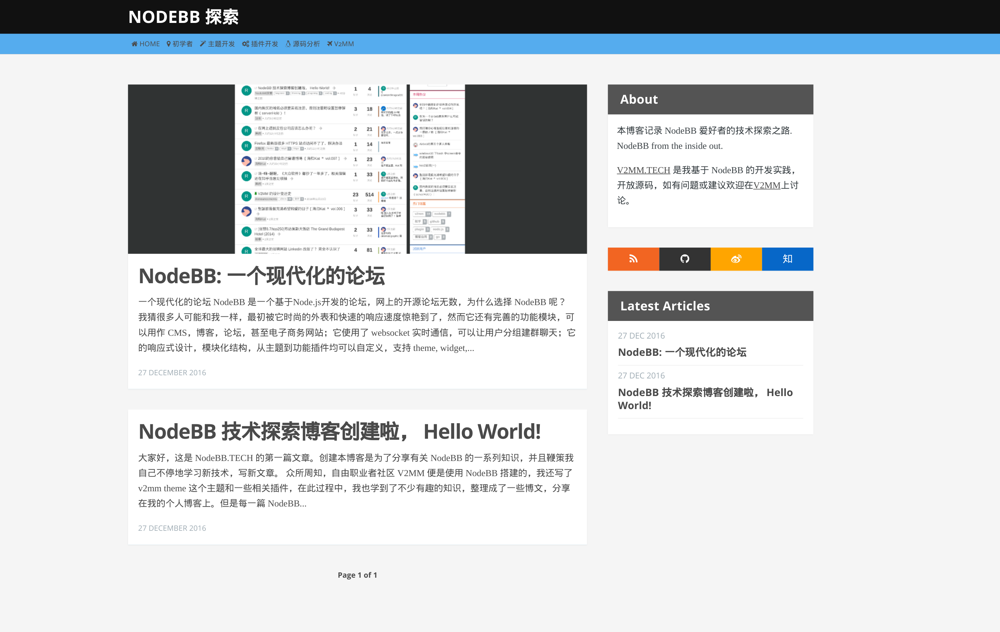

This is a ghost theme used by [NodeBB.TECH](http://nodebb.tech), which is a tech blog writing about NodeBB from the inside out.
This theme is forked from [ghost-wbkd](https://github.com/wbkd/ghost-wbkd), thanks for his excellent job.
This theme is under actively development, be careful if you want to use it, some of the codes may be not suitable for your site.

# ghost-wbkd
A [ghost](https://ghost.org/)/[journey](https://github.com/kabukky/journey) theme.


# Screenshot
[](http://nodebb.tech)

**See it live on [NodeBB.TECH](http://nodebb.tech)**

### Install

To install the theme, clone this repository into your theme folder of your ghost installation:

```
$ cd path-to-ghost/content/themes
$ git clone https://github.com/wbkd/ghost-wbkd.git
```

After that, restart the blog and select the webkid theme in your ghost admin panel.

### Customize

Due to restrictions of the Ghost templates, some values are hard-coded at the moment. To customize the theme, you have to edit the Handlebars templates in the theme folder.
